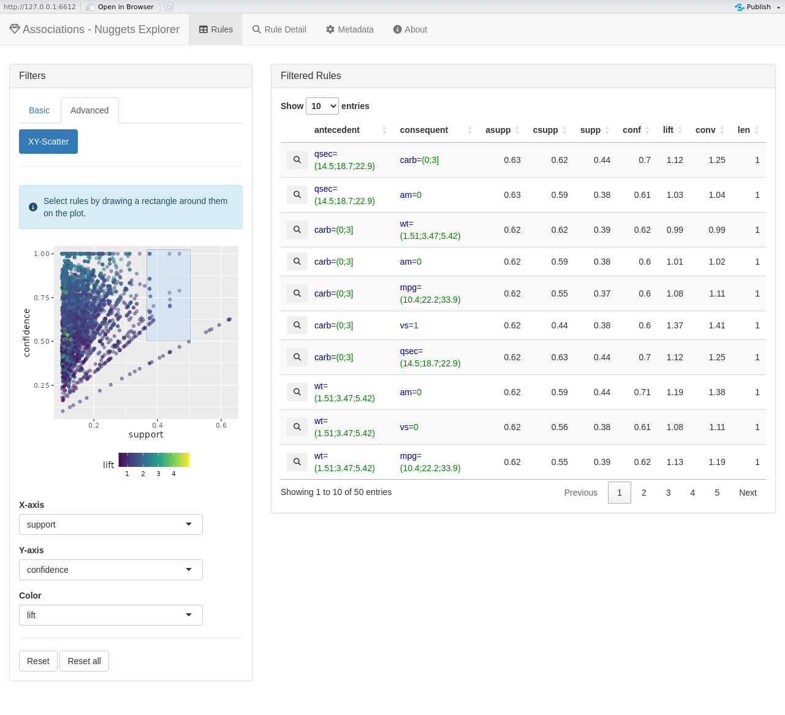

<!-- README.md is generated from README.Rmd. Please edit that file -->

```{r, include = FALSE}
knitr::opts_chunk$set(
  collapse = TRUE,
  comment = "#>",
  fig.path = "man/figures/README-",
  out.width = "100%"
)
```

<!-- badges: start -->
[](https://CRAN.R-project.org/package=nuggets)
[](https://app.codecov.io/gh/beerda/nuggets)
[](https://cran.r-project.org/package=nuggets)
[](https://github.com/beerda/nuggets/actions/workflows/R-CMD-check.yaml)
[](https://github.com/beerda/nuggets/actions/workflows/test-coverage.yaml)
<!-- badges: end -->

# nuggets


A framework for systematic exploration of
**association rules** ([Agrawal (1994)](https://www.vldb.org/conf/1994/P487.PDF)),
**contrast patterns** ([Chen (2022)](https://doi.org/10.48550/arXiv.2209.13556)),
**emerging patterns** ([Dong (1999)](https://doi.org/10.1145/312129.312191)),
**subgroup discovery** ([Atzmueller (2015)](https://doi.org/10.1002/widm.1144)), and
**conditional correlations** ([Hájek (1978)](https://doi.org/10.1007/978-3-642-66943-9)).
User-defined functions may also be supplied to guide custom pattern searches.

Supports both **crisp** (Boolean) and **fuzzy** data. Generates candidate conditions
expressed as elementary conjunctions, evaluates them on a dataset, and
inspects the induced sub-data for statistical, logical, or structural
properties such as  associations, correlations, or contrasts. Includes methods 
for **visualization** of logical structures and supports **interactive exploration**
through integrated Shiny applications. 


## Key Features

- Support for both **categorical** and **numeric data**.
- Provides both **Boolean** and **fuzzy** logic approach.
- Data preparation functions for easy pre-processing phase.
- Functions for examining **associations**, **conditional correlations**, 
  and **contrasts** among data variables.
- **Visualization** and pattern post-processing tools.
- Integrated Shiny applications for **interactive exploration** of discovered patterns.


 
## Documentation

Read the [full documentation of the nuggets package](https://beerda.github.io/nuggets/).


## Installation

To install the stable version of `nuggets` from CRAN, type the following command
within the R session:

``` r
install.packages("nuggets")
```

You can also install the development version of `nuggets` from 
[GitHub](https://github.com/) with:

``` r
install.packages("devtools")
devtools::install_github("beerda/nuggets")
```

To start using the package, load it to the R session with:

```{r}
library(nuggets)
```


## Minimal Example

The following example demonstrates how to use `nuggets` to find association rules
in the built-in `mtcars` dataset:

```{r, eval=FALSE}
# Preprocess: dichotomize and fuzzify numeric variables
cars <- mtcars |>
    partition(cyl, vs:gear, .method = "dummy") |>
    partition(carb, .method = "crisp", .breaks = c(0, 3, 10)) |>
    partition(mpg, disp:qsec, .method = "triangle", .breaks = 3)

# Search for associations among conditions
rules <- dig_associations(cars,
                          antecedent = everything(),
                          consequent = everything(),
                          max_length = 4,
                          min_support = 0.1,
                          measures = c("lift", "conviction"))

# Explore the found rules interactively
explore(rules, cars)
```




## Contributing

Contributions, suggestions, and bug reports are welcome. Please submit
[issues](https://github.com/beerda/nuggets/issues/) on [GitHub](https://github.com/).

