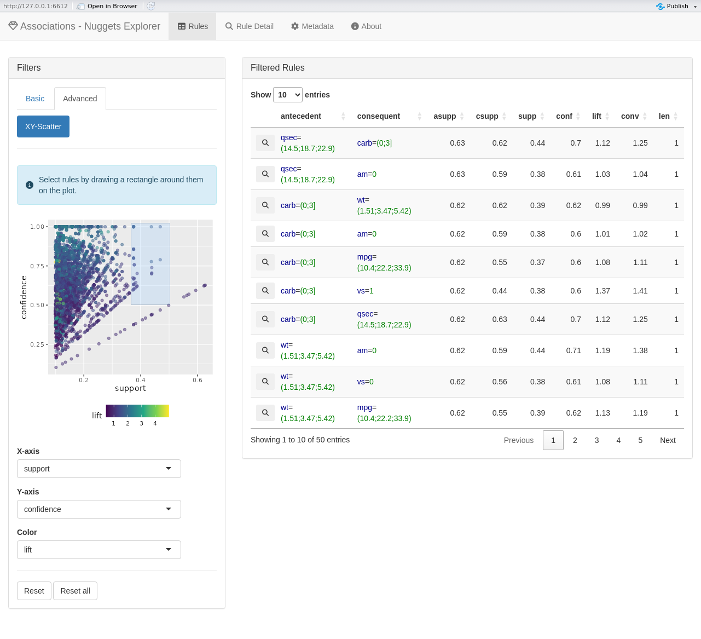

<!-- README.md is generated from README.Rmd. Please edit that file -->

<!-- badges: start -->

[](https://CRAN.R-project.org/package=nuggets)
[](https://app.codecov.io/gh/beerda/nuggets)
[](https://cran.r-project.org/package=nuggets)
[](https://github.com/beerda/nuggets/actions/workflows/R-CMD-check.yaml)
[](https://github.com/beerda/nuggets/actions/workflows/test-coverage.yaml)
<!-- badges: end -->

# nuggets


*Fast and extensible pattern mining in R - fuzzy association rules,
conditional correlations, and contrast patterns*

`nuggets` is a package for [R](https://www.r-project.org/) providing a
fast and extensible framework for discovering interesting patterns in
tabular data. It can find association rules, contrasts, subgroup
patterns, conditional correlations, and other patterns defined by
user-specified evaluation functions. Both Boolean and fuzzy predicates
are supported. Efficient implementation enables pattern discovery on
large and dense data sets. Package includes methods for
**visualization** and supports **interactive exploration** through
integrated Shiny applications.

## What Patterns Can You Discover?

- **Association Rules**: *“University educated people in middle age
  working in IT have high income”* - identify conditions that strongly
  predict specific outcomes.
- **Conditional Correlations**: *“Study time correlates with test score
  on hard exams”* - discover relationships between variables that only
  hold under certain conditions .
- **Complement Contrasts**: *“Smokers have lower life expectancy than
  non-smokers”* - find subgroups with significantly different
  characteristics from the rest.
- **Baseline Contrasts**: *“Measurement error differs from zero when
  using tool A”* - detect when a variable deviates significantly from a
  baseline under specific conditions.
- **Paired Contrasts**: *“Ice cream sales exceed tea sales on sunny
  days”* – compare paired measurements within specific contexts.
- **Custom Patterns**: Define your own evaluation functions for
  specialized pattern mining.

## Why nuggets?

`arules` is the established R framework for transaction-based
association-rule and frequent-itemset mining. The `nuggets` package
takes a broader approach: it searches combinations of conditions and
evaluates the observations they select. This makes association rules
just one of several types of patterns that can be discovered.

Key advantages of `nuggets` include:

- **Beyond association rules** - discover associations, contrasts,
  subgroup patterns, conditional correlations, and other patterns
  defined by your own evaluation function.
- **Boolean and fuzzy predicates** - work with both crisp conditions and
  fuzzy predicates, allowing patterns to express gradual concepts such
  as *young*, *high income*, or *strongly associated*.
- **Works naturally with ordinary data frames** - search directly in
  tabular R data rather than requiring the data to be converted into a
  transaction representation first.
- **Numeric and categorical data** - combine conditions on different
  types of variables and, where appropriate, use `partition()` to
  construct meaningful predicates from numeric or factor variables.
- **Extensible pattern discovery** - `dig()` provides a general
  mechanism for searching candidate conditions and evaluating the
  resulting subsets of observations with arbitrary user-defined
  functions.
- **Fast pattern search** - implemented in C++ with performance in mind,
  including efficient processing of large and dense datasets.
- **Visualization** - unique tools for visualizing discovered patterns
  and their relationships.
- **Interactive exploration** - inspect and explore discovered patterns
  using the package’s Shiny app.

## Fast on Dense Datasets

A lot of effort has been put into optimizing the performance of the
package, especially for dense datasets. The core algorithms are
implemented in C++ and use single-instruction multiple-data (SIMD)
operations to speed up the operations.

On a randomly generated dataset with 1 million rows and 15 columns,
association rules with at most 5 items in the antecedent, a support
above 0.001, and a confidence above 0.5 were searched. The total times,
including reading the data from the CSV file, searching for rules, and
writing the result back to CSV, on a Linux desktop computer with
standard installations of the packages, were as follows:

- `nuggets` (R, boolean logic): **1.4 s**
- `arules` - ECLAT (R, boolean logic): **2.9 s**
- `arules` - Apriori (R, boolean logic): **3.3 s**

Fuzzy variant of association rules, which is much more computationally
intensive:

- `nuggets` (R, fuzzy logic): **12.0 s**

For comparison, two Python libraries performed as follows:

- `cleverminer` (Python, boolean logic): **1m 15.0s**
- `mlxtend` (Python, boolean logic, frequent itemsets only): **4h 11m
  22.5s**

## Installation

To install the stable version of `nuggets` from CRAN, type the following
command within the R session:

``` r
install.packages("nuggets", dependencies = TRUE)
```

You can also install the development version of `nuggets` from
[GitHub](https://github.com/) with:

``` r
install.packages("devtools")
devtools::install_github("beerda/nuggets")
```

To start using the package, load it to the R session with:

``` r
library(nuggets)
```

## Minimal Example

The following example demonstrates how to use `nuggets` to find
association rules in the built-in `mtcars` dataset:

``` r
# Preprocess: dichotomize and fuzzify numeric variables
cars <- mtcars |>
    partition(cyl, vs:gear, .method = "dummy") |>
    partition(carb, .method = "crisp", .breaks = c(0, 3, 10)) |>
    partition(mpg, disp:qsec, .method = "triangle", .breaks = 3)

# Search for associations among conditions
rules <- dig_associations(cars,
                          antecedent = everything(),
                          consequent = everything(),
                          max_length = 4,
                          min_support = 0.1)

# Add various interest measures
rules <- add_interest(rules)

# Explore the found rules interactively
explore(rules, cars)
```



## Documentation

Read the [full documentation of the nuggets
package](https://beerda.github.io/nuggets/).

## Vignettes

The package currently includes the following vignettes:

- [nuggets: Get
  Started](https://beerda.github.io/nuggets/articles/nuggets.html)
- [Data
  Preparation](https://beerda.github.io/nuggets/articles/data-preparation.html)
- [Association
  Rules](https://beerda.github.io/nuggets/articles/association-rules.html)
- [Conditional
  Correlations](https://beerda.github.io/nuggets/articles/conditional-correlations.html)
- [Contrast
  Patterns](https://beerda.github.io/nuggets/articles/contrast-patterns.html)
- [Custom Pattern Search with
  dig()](https://beerda.github.io/nuggets/articles/custom-patterns.html)

## Contributing

Contributions, suggestions, and bug reports are welcome. Please submit
[issues](https://github.com/beerda/nuggets/issues/) on
[GitHub](https://github.com/).

## License

This package is licensed under the GPL-3 license.

It includes third-party code licensed under BSD-2-Clause, BSD-3-Clause,
and GPL-2 or later licenses. See `inst/COPYRIGHTS` for details.

## References

Burda, M. [Accelerating Pattern Mining on Fuzzy Data by Packing Truth
Values into Blocks of Bits](https://doi.org/10.1016/j.asoc.2026.114661).
*Applied Soft Computing*. 2026, **191** (April 2026), ISSN 1568-4946.
