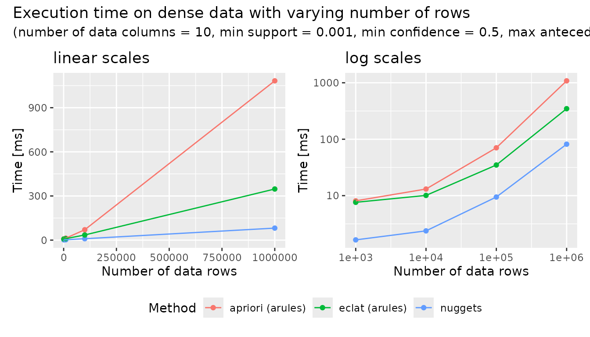
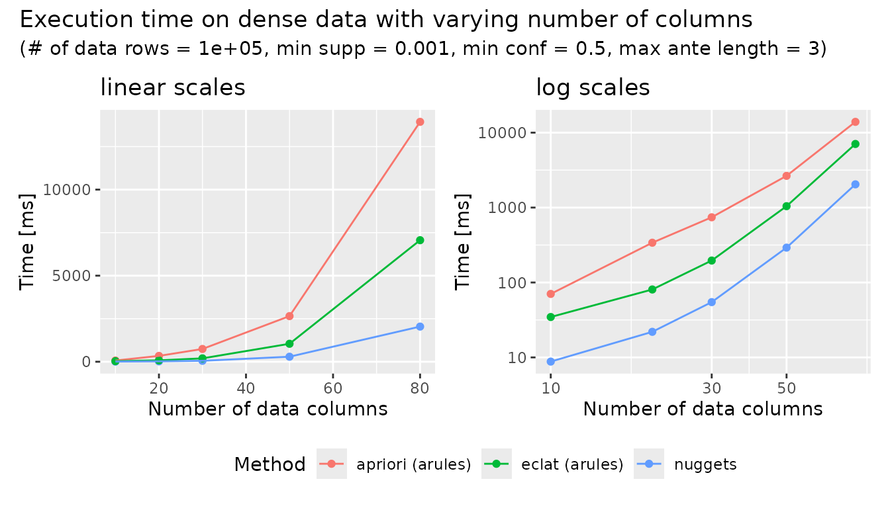
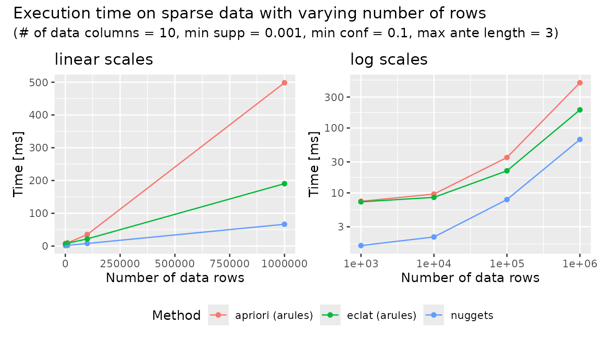
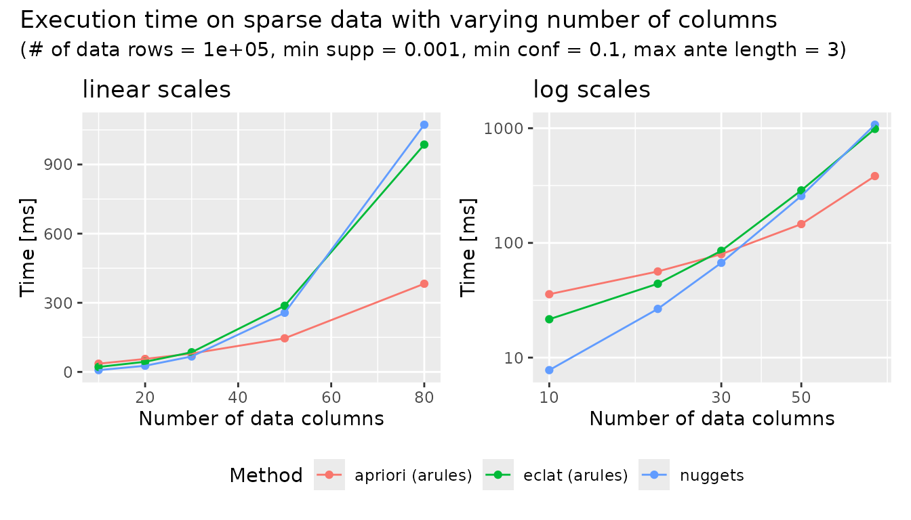

# Performance of nuggets and arules in Association Rule Mining

## Introduction

This vignette compares the performance of the `nuggets` and `arules`
packages in R on the task of *association rule mining*. The comparison
focuses on the time needed to discover association rules *from Boolean
datasets* of varying sizes and sparsity levels. The goal is to provide a
rough comparison of computational power rather than a full comparison of
package functionality, so advanced features, filtering options, and
other factors that may affect practical performance are not considered
here.

For reproducibility, the [benchmark script used in this
vignette](https://github.com/beerda/nuggets/tree/main/misc/performance/nuggets_vs_arules)
is available in the package repository on GitHub.

## Materials and Methods

A series of experiments were conducted to evaluate the performance of
the `nuggets` and `arules` packages. For `arules`, two different
algorithms were evaluated: the Apriori algorithm (`apriori()`) and and
the Eclat algorithm (`eclat()`). For `nuggets`, the
[`dig_associations()`](https://beerda.github.io/nuggets/reference/dig_associations.md)
function was used to discover association rules. The experiments were
designed to measure the execution time of each method under different
conditions, including varying the number of rows and columns in the
datasets, as well as the sparsity of the data.

The test datasets were randomly generated with binary values
(TRUE/FALSE) and varying numbers of rows and columns. The sparsity of
the data was controlled by adjusting the probability of TRUE values in
the dataset.

Specifically, the following parameters were varied in the experiments:

- number of rows: 10³, 10⁴, 10⁵, 10⁶
- number of columns: 10, 20, 30, 50, 80
- the probability of TRUE values: 0.5 (dense datasets) and 0.1 (sparse
  datasets)

The other parameters were kept constant across all experiments:

- the minimum support threshold: 0.001
- the minimum confidence threshold: 0.5 (dense datasets) and 0.1 (sparse
  datasets)
- the maximum length of antecedents: 3

Each experiment was repeated 5 times to ensure the reliability of the
results, and the average execution time was recorded. The results are
visualized using both linear and logarithmic scales to provide insights
into the performance characteristics of each method. All experiments
were conducted on AMD Ryzen 9 5900X 12-Core Processor (512 KB cache)
with 62.7 GB of RAM available.

## Results

### Dense data: varying number of rows

[TABLE]

### Dense data: varying number of columns

[TABLE]

### Sparse data: varying number of rows

[TABLE]

### Sparse data: varying number of columns

[TABLE]

## Discussion

The results show that the relative performance of `nuggets` and `arules`
depends strongly on the structure of the data, particularly on its
dimensionality and sparsity. In general, `nuggets` performs best when
the number of predicates is small to moderate, whereas `arules` becomes
increasingly competitive as the data become sparser and the number of
predicates grows.

### Dense data

For dense datasets with a fixed number of rows, all methods become
slower as the number of columns increases. Nevertheless, nuggets remains
the fastest across the entire range considered. `arule`’s `eclat()` is
consistently slower than `nuggets` but faster than `arule`’s
`apriori()`. Although the computational cost rises rapidly for all three
methods as the number of predicates grows, the relative ordering does
not change in the dense-data experiments.

### Sparse data

For sparse datasets with a fixed number of columns, the same general
ranking is observed as in the dense case. Execution time increases with
the number of rows, but `nuggets` remains the fastest method throughout,
with `arule`’s `eclat()` second and `apriori()` third. The results
suggest that `nuggets` also scales favorably with increasing dataset
size in sparse data, at least when the number of columns remains small.

A different pattern emerges when the number of columns increases in
sparse datasets. For smaller and moderate numbers of columns, `nuggets`
remains the fastest method. However, the gap between methods narrows as
dimensionality grows. At higher numbers of columns, `arule`’s
`apriori()` overtakes both Eclat-based approaches (yes, `nuggets` is
inspirred with the Eclat algorithm internally) and becomes the fastest
method, while `nuggets` becomes the slowest among the three. This
indicates that sparse, high-dimensional data favor the search strategy
used by `apriori()` over the recursion-based approaches used by
`eclat()` and `nuggets`.

Overall, the experiments indicate that `nuggets` performs best in low-
to medium-dimensional settings, both dense and sparse, and shows very
good scalability with increasing numbers of rows. In contrast, for
sparse datasets with many predicates, `apriori()` becomes more efficient
and ultimately provides the best performance.

### Why `nuggets` performs well

A likely explanation for the strong performance of `nuggets` is its
highly optimized implementation of conjunction counting and support
computation. These operations are central to rule discovery, and in
`nuggets` they are accelerated using SIMD instructions together with an
efficient `popcount` method. This makes the evaluation of candidate
conjunctions particularly fast and is reflected in the consistently
strong performance of `nuggets` in experiments with increasing numbers
of rows. In such settings, the amount of data to be processed grows, but
the low-level optimizations allow `nuggets` to maintain a substantial
runtime advantage. All nuggets optimizations are available with the
default compiler directives recommended by CRAN, without requiring any
non-standard package installation settings.

## Summary

The results show that `nuggets` is particularly effective for low- to
medium-dimensional data, where its optimized implementation provides
consistently strong performance. For sparse data with many predicates,
however, `arules`, especially `apriori()`, becomes more advantageous.
Overall, the comparison highlights that the best choice depends mainly
on data sparsity and dimensionality.

For additional information on the `nuggets` package, see:

- [`vignette("nuggets")`](https://beerda.github.io/nuggets/articles/nuggets.md)
  for an overview of the package and its main workflows,
- [`vignette("association-rules")`](https://beerda.github.io/nuggets/articles/association-rules.md)
  for a specialized pattern family based on the
  [`dig_associations()`](https://beerda.github.io/nuggets/reference/dig_associations.md)
  function,
- [`vignette("conditional-correlations")`](https://beerda.github.io/nuggets/articles/conditional-correlations.md)
  for subgroup-based correlation analysis on numeric variables,
- [`vignette("contrast-patterns")`](https://beerda.github.io/nuggets/articles/contrast-patterns.md)
  for subgroup-based statistical comparisons of numeric variables,
- [`vignette("custom-patterns")`](https://beerda.github.io/nuggets/articles/custom-patterns.md)
  for defining custom pattern types.
