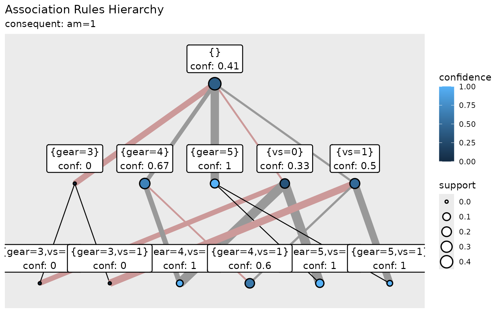

# nuggets: Get Started

## Introduction

Package `nuggets` searches for patterns that can be expressed as
formulae in the form of elementary conjunctions, referred to in this
text as *conditions*. Conditions are constructed from *predicates*,
which correspond to data columns. The interpretation of conditions
depends on the choice of underlying logic:

- *Crisp (Boolean) logic*: each predicate takes values `TRUE` (1) or
  `FALSE` (0). The truth value of a condition is computed according to
  the rules of classical Boolean algebra.

- *Fuzzy logic*: each predicate is assigned a *truth degree* from the
  interval \\\[0, 1\]\\. The truth degree of a conjunction is then
  computed using a chosen *triangular norm (t-norm)*. The package
  supports three common t-norms, which are defined for predicates’ truth
  degrees \\a, b \in \[0, 1\]\\ as follows:

  - *Gödel* (minimum) t-norm: \\\min(a, b)\\ ;
  - *Goguen* (product) t-norm: \\a \cdot b\\ ;
  - *Łukasiewicz* t-norm: \\\max(0, a + b - 1)\\

Before applying `nuggets`, data columns intended as predicates must be
prepared either by *dichotomization* (conversion into *dummy* logical
variables) or by transformation into *fuzzy sets*. The package provides
functions for both transformations. See the [section](#data-preparation)
Data Preparation below for a quick overview, or the [Data
Preparation](https://beerda.github.io/nuggets/articles/data-preparation.md)
vignette for a comprehensive guide.

`nuggets` implements functions to search for pre-defined types of
patterns or to discover patterns of *user-defined* type. For example,
the package provides:

- [`dig_associations()`](https://beerda.github.io/nuggets/reference/dig_associations.md)
  for association rules,
- [`dig_baseline_contrasts()`](https://beerda.github.io/nuggets/reference/dig_baseline_contrasts.md),
  [`dig_complement_contrasts()`](https://beerda.github.io/nuggets/reference/dig_complement_contrasts.md),
  and
  [`dig_paired_baseline_contrasts()`](https://beerda.github.io/nuggets/reference/dig_paired_baseline_contrasts.md)
  for various contrast patterns on numeric variables,
- [`dig_correlations()`](https://beerda.github.io/nuggets/reference/dig_correlations.md)
  for conditional correlations.

To provide custom evaluation functions for conditions and to search for
*user-defined* types of patterns, the package offers two general
functions:

- [`dig()`](https://beerda.github.io/nuggets/reference/dig.md) is a
  general function for searching arbitrary pattern types.
- [`dig_grid()`](https://beerda.github.io/nuggets/reference/dig_grid.md)
  is a wrapper around
  [`dig()`](https://beerda.github.io/nuggets/reference/dig.md) for
  patterns defined by conditions and a pair of columns evaluated by a
  user-defined function.

See the section [Pre-defined Patterns](#pre-defined-patterns) below for
examples and details on using the pre-defined pattern discovery
functions and the section [Advanced Use](#advanced-use) for examples of
custom pattern discovery.

Discovered rules and patterns can be post-processed, visualized, and
explored interactively. That part is covered in the section
[Post-processing and Visualization](#postprocessing-and-visualization)
below.

## Data Preparation

Before applying `nuggets`, data columns intended as predicates must be
prepared either by *dichotomization* (conversion into *dummy variables*)
or by transformation into *fuzzy sets*. The package provides the
[`partition()`](https://beerda.github.io/nuggets/reference/partition.md)
function for both transformations.

This section gives a quick overview of data preparation with `nuggets`.
For a detailed guide, including information about all available
functions and advanced techniques, please see the [Data Preparation
Vignette](https://beerda.github.io/nuggets/articles/data-preparation.md).

### Crisp (Boolean) Predicates Example

For crisp patterns, numeric columns are transformed to logical
(`TRUE`/`FALSE`) columns. To show the process, we start with the
built-in `mtcars` dataset, which we first slightly modify by converting
the `cyl` column to a factor:

``` r
# For demonstration, convert 'cyl' column of the mtcars dataset to a factor
mtcars <- mtcars |>
    mutate(cyl = factor(cyl, levels = c(4, 6, 8), labels = c("four", "six", "eight")))

head(mtcars, n = 3)
#>                mpg  cyl disp  hp drat    wt  qsec vs am gear carb
#> Mazda RX4     21.0  six  160 110 3.90 2.620 16.46  0  1    4    4
#> Mazda RX4 Wag 21.0  six  160 110 3.90 2.875 17.02  0  1    4    4
#> Datsun 710    22.8 four  108  93 3.85 2.320 18.61  1  1    4    1
```

Now we can use the
[`partition()`](https://beerda.github.io/nuggets/reference/partition.md)
function to transform all columns into crisp predicates:

``` r
# Transform the whole dataset to crisp predicates
crisp_mtcars <- mtcars |>
    partition(cyl, vs:gear, .method = "dummy") |>
    partition(mpg, .method = "crisp", .breaks = c(-Inf, 15, 20, 30, Inf)) |>
    partition(disp:carb, .method = "crisp", .breaks = 3) 

head(crisp_mtcars, n = 3)
#> # A tibble: 3 × 32
#>   `cyl=four` `cyl=six` `cyl=eight` `vs=0` `vs=1` `am=0` `am=1` `gear=3` `gear=4`
#>   <lgl>      <lgl>     <lgl>       <lgl>  <lgl>  <lgl>  <lgl>  <lgl>    <lgl>   
#> 1 FALSE      TRUE      FALSE       TRUE   FALSE  FALSE  TRUE   FALSE    TRUE    
#> 2 FALSE      TRUE      FALSE       TRUE   FALSE  FALSE  TRUE   FALSE    TRUE    
#> 3 TRUE       FALSE     FALSE       FALSE  TRUE   FALSE  TRUE   FALSE    TRUE    
#>   `gear=5` `mpg=(-Inf;15]` `mpg=(15;20]` `mpg=(20;30]` `mpg=(30;Inf]`
#>   <lgl>    <lgl>           <lgl>         <lgl>         <lgl>         
#> 1 FALSE    FALSE           FALSE         TRUE          FALSE         
#> 2 FALSE    FALSE           FALSE         TRUE          FALSE         
#> 3 FALSE    FALSE           FALSE         TRUE          FALSE         
#>   `disp=(-Inf;205]` `disp=(205;338]` `disp=(338;Inf]` `hp=(-Inf;146]`
#>   <lgl>             <lgl>            <lgl>            <lgl>          
#> 1 TRUE              FALSE            FALSE            TRUE           
#> 2 TRUE              FALSE            FALSE            TRUE           
#> 3 TRUE              FALSE            FALSE            TRUE           
#>   `hp=(146;241]` `hp=(241;Inf]` `drat=(-Inf;3.48]` `drat=(3.48;4.21]`
#>   <lgl>          <lgl>          <lgl>              <lgl>             
#> 1 FALSE          FALSE          FALSE              TRUE              
#> 2 FALSE          FALSE          FALSE              TRUE              
#> 3 FALSE          FALSE          FALSE              TRUE              
#>   `drat=(4.21;Inf]` `wt=(-Inf;2.82]` `wt=(2.82;4.12]` `wt=(4.12;Inf]`
#>   <lgl>             <lgl>            <lgl>            <lgl>          
#> 1 FALSE             TRUE             FALSE            FALSE          
#> 2 FALSE             FALSE            TRUE             FALSE          
#> 3 FALSE             TRUE             FALSE            FALSE          
#>   `qsec=(-Inf;17.3]` `qsec=(17.3;20.1]` `qsec=(20.1;Inf]` `carb=(-Inf;3.33]`
#>   <lgl>              <lgl>              <lgl>             <lgl>             
#> 1 TRUE               FALSE              FALSE             FALSE             
#> 2 TRUE               FALSE              FALSE             FALSE             
#> 3 FALSE              TRUE               FALSE             TRUE              
#>   `carb=(3.33;5.67]` `carb=(5.67;Inf]`
#>   <lgl>              <lgl>            
#> 1 TRUE               FALSE            
#> 2 TRUE               FALSE            
#> 3 FALSE              FALSE
```

As seen above, the `"dummy"` method can be used to create logical
columns for each category of processed variables. Here, it was applied
to create dummy variables for the factor variable `cyl` as well as for
the numeric variables `vs`, `am`, and `gear`.

The method `"crisp"` creates logical columns representing intervals for
numeric variables. In the example, it was used to create intervals for
`mpg` based on specified breakpoints (`-Inf`, `15`, `20`, `30`, `Inf`),
and for `disp`, `hp`, `drat`, `wt`, `qsec`, and `carb` using equal-width
intervals (3 intervals each).

Now all columns are logical and can be used as predicates in crisp
conditions.

### Fuzzy Predicates Example

Fuzzy predicates express the degree to which a condition is satisfied,
with values in the interval \\\[0,1\]\\. This allows modeling of smooth
transitions between categories:

``` r
# Start with fresh mtcars and transform to fuzzy predicates
fuzzy_mtcars <- mtcars |>
    partition(cyl, vs:gear, .method = "dummy") |>
    partition(mpg, .method = "triangle", .breaks = c(-Inf, 15, 20, 30, Inf)) |>
    partition(disp:carb, .method = "triangle", .breaks = 3) 

head(fuzzy_mtcars, n = 3)
#> # A tibble: 3 × 31
#>   `cyl=four` `cyl=six` `cyl=eight` `vs=0` `vs=1` `am=0` `am=1` `gear=3` `gear=4`
#>   <lgl>      <lgl>     <lgl>       <lgl>  <lgl>  <lgl>  <lgl>  <lgl>    <lgl>   
#> 1 FALSE      TRUE      FALSE       TRUE   FALSE  FALSE  TRUE   FALSE    TRUE    
#> 2 FALSE      TRUE      FALSE       TRUE   FALSE  FALSE  TRUE   FALSE    TRUE    
#> 3 TRUE       FALSE     FALSE       FALSE  TRUE   FALSE  TRUE   FALSE    TRUE    
#>   `gear=5` `mpg=(-Inf;15;20)` `mpg=(15;20;30)` `mpg=(20;30;Inf)`
#>   <lgl>                 <dbl>            <dbl>             <dbl>
#> 1 FALSE                     0             0.9               0.1 
#> 2 FALSE                     0             0.9               0.1 
#> 3 FALSE                     0             0.72              0.28
#>   `disp=(-Inf;71.1;272)` `disp=(71.1;272;472)` `disp=(272;472;Inf)`
#>                    <dbl>                 <dbl>                <dbl>
#> 1                  0.557                 0.443                    0
#> 2                  0.557                 0.443                    0
#> 3                  0.816                 0.184                    0
#>   `hp=(-Inf;52;194)` `hp=(52;194;335)` `hp=(194;335;Inf)`
#>                <dbl>             <dbl>              <dbl>
#> 1              0.592             0.408                  0
#> 2              0.592             0.408                  0
#> 3              0.711             0.289                  0
#>   `drat=(-Inf;2.76;3.84)` `drat=(2.76;3.84;4.93)` `drat=(3.84;4.93;Inf)`
#>                     <dbl>                   <dbl>                  <dbl>
#> 1                       0                   0.945                0.0550 
#> 2                       0                   0.945                0.0550 
#> 3                       0                   0.991                0.00917
#>   `wt=(-Inf;1.51;3.47)` `wt=(1.51;3.47;5.42)` `wt=(3.47;5.42;Inf)`
#>                   <dbl>                 <dbl>                <dbl>
#> 1                 0.434                 0.566                    0
#> 2                 0.304                 0.696                    0
#> 3                 0.587                 0.413                    0
#>   `qsec=(-Inf;14.5;18.7)` `qsec=(14.5;18.7;22.9)` `qsec=(18.7;22.9;Inf)`
#>                     <dbl>                   <dbl>                  <dbl>
#> 1                  0.533                    0.467                      0
#> 2                  0.4                      0.6                        0
#> 3                  0.0214                   0.979                      0
#>   `carb=(-Inf;1;4.5)` `carb=(1;4.5;8)` `carb=(4.5;8;Inf)`
#>                 <dbl>            <dbl>              <dbl>
#> 1               0.143            0.857                  0
#> 2               0.143            0.857                  0
#> 3               1                0                      0
```

Similar to the crisp example, the `"dummy"` method creates logical
columns for categorical variables (`cyl`, `vs`, `am`, `gear`).

The `"triangle"` method creates fuzzy predicates with triangular
membership functions. For `mpg`, it uses specified breakpoints to define
fuzzy intervals. For the remaining numeric variables (`disp` through
`carb`), it automatically creates 3 overlapping fuzzy sets with smooth
transitions between intervals.

Note that the `cyl`, `vs`, `am`, and `gear` columns are still
represented by dummy logical columns, while the numeric columns are now
represented by fuzzy sets. This combination allows both crisp and fuzzy
predicates to be used together in pattern discovery.

### Advanced Data Preparation Capabilities

The `nuggets` package provides powerful and flexible data preparation
tools. The [Data
Preparation](https://beerda.github.io/nuggets/articles/data-preparation.md)
vignette covers these capabilities in depth, including:

- **Crisp (Boolean) partitioning** with customizable interval
  strategies:
  - Equal-width intervals for uniform discretization
  - Data-driven methods (quantile, k-means, hierarchical clustering,
    etc.) for optimal breakpoints that respect the data structure
  - Custom breakpoints for domain-specific intervals
- **Fuzzy partitioning** for modeling gradual transitions and
  uncertainty:
  - Triangular membership functions for basic fuzzy sets
  - Raised-cosine membership functions for smoother transitions
  - Trapezoidal shapes using `.span` and `.inc` parameters for
    overlapping fuzzy sets
- **Quality control utilities** to improve pattern mining:
  - [`is_almost_constant()`](https://beerda.github.io/nuggets/reference/is_almost_constant.md)
    and
    [`remove_almost_constant()`](https://beerda.github.io/nuggets/reference/remove_almost_constant.md)
    to identify and filter uninformative columns
  - [`dig_tautologies()`](https://beerda.github.io/nuggets/reference/dig_tautologies.md)
    to find always-true or almost-always-true rules that can be used to
    prune search spaces
- **Custom labels** for predicates to make discovered patterns more
  interpretable

For example, you can use quantile-based partitioning to ensure balanced
predicates, or use raised-cosine fuzzy sets with custom labels to create
meaningful linguistic terms like “very_low”, “low”, “medium”, “high”,
and “very_high”. These preparation choices significantly impact the
interpretability and usefulness of patterns discovered in subsequent
analyses.

## Pre-defined Patterns

The package `nuggets` provides a set of functions for discovering some
of the best-known pattern types. These functions can process Boolean
data, fuzzy data, or both. Each function returns a tibble, where every
row represents one detected pattern.

> **Note:** This section assumes that the data have already been
> **preprocessed** — i.e., transformed into a binarized or fuzzified
> form. See the previous section [Data Preparation](#data-preparation)
> for details on how to prepare your dataset (for example,
> `crisp_mtcars` and `fuzzy_mtcars`).

For more advanced workflows — such as defining custom pattern types or
computing user-defined measures — see the section [Advanced
Use](#advanced-use).

### Search for Association Rules

**Association rules** identify conditions (*antecedents*) under which a
specific feature (*consequent*) is present very often.

\\ A \Rightarrow C \\

If condition `A` is satisfied, then the feature `C` tends to be present.

For example,

`university_edu & middle_age & IT_industry => high_income`

can be read as:

*People in middle age with university education working in IT industry
are very likely to have a high income.*

In practice, the antecedent `A` is a set of predicates, and the
consequent `C` is usually a single predicate.

For a set of predicates \\I\\, let \\\text{supp}(I)\\ denote the
*support* — the relative frequency (for logical data) or the mean truth
degree (for fuzzy data) of rows satisfying all predicates in \\I\\.
Using this notation, the following rule properties and quality measures
may be defined:

- **Length** — number of predicates in the antecedent.  
- **Coverage** (antecedent support) — \\\text{supp}(A)\\.  
- **Consequent support** — \\\text{supp}(C)\\.  
- **Support** — \\\text{supp}(A \cup C)\\.  
- **Confidence** — \\\text{supp}(A \cup C) / \text{supp}(A)\\.
- **Lift** — \\\text{supp}(A \cup C) / (\text{supp}(A)
  \text{supp}(C))\\.

Rules with high *support* are frequent in the data. Rules with high
*confidence* indicate a strong association between antecedent and
consequent. Rules with high *lift* suggest that the validity of
antecedent increases the likelihood of the consequent occurring.

Before searching for rules, it is recommended to create a *vector of
disjoints*, which specifies predicates that must not appear together in
the same condition. This vector should have the same length as the
number of dataset columns.

For example, columns representing `gear=3` and `gear=4` are mutually
exclusive, so their shared group label in `disj` prevents meaningless
conditions like `gear=3 & gear=4`. You can conveniently generate this
vector with
[`var_names()`](https://beerda.github.io/nuggets/reference/var_names.md):

``` r
disj <- var_names(colnames(fuzzy_mtcars))
print(disj)
#>  [1] "cyl"  "cyl"  "cyl"  "vs"   "vs"   "am"   "am"   "gear" "gear" "gear"
#> [11] "mpg"  "mpg"  "mpg"  "disp" "disp" "disp" "hp"   "hp"   "hp"   "drat"
#> [21] "drat" "drat" "wt"   "wt"   "wt"   "qsec" "qsec" "qsec" "carb" "carb"
#> [31] "carb"
```

The
[`dig_associations()`](https://beerda.github.io/nuggets/reference/dig_associations.md)
function searches for association rules. Its main arguments are:

- `x`: the data matrix or data frame (logical or numeric);
- `antecedent`, `consequent`: tidyselect expressions selecting columns
  for each side of the rule;
- `disjoint`: a vector defining mutually exclusive predicates;
- rule filtering thresholds such as `min_support`, `min_confidence`,
  `min_coverage`, and limits like `min_length`, `max_length`;
- optional parameters such as `t_norm`, and `contingency_table`.

In the following example, we search for fuzzy association rules in the
dataset `fuzzy_mtcars`, such that:

- any column except those starting with `"am"` may appear in the
  antecedent;
- columns starting with `"am"` may appear in the consequent;
- minimum support is `0.02`, i.e., 2 % of data rows have to contain both
  the antecedent and consequent of the rule;
- minimum confidence is `0.8`, i.e., the conditional probability of
  consequent given antecedent should be at least 80%;
- additionally to basic quality measures, the contingency table for each
  rule is computed. The *contingency table* is a quadruplet `pp`, `pn`,
  `np` and `nn`, which contains the counts (or sums of degrees) of rows
  satisfying antecedent & consequent (`pp`), antecedent & not consequent
  (`pn`), not antecedent & consequent (`np`), and not antecedent & not
  consequent (`nn`). These values are important for further computation
  of various additional interestingness measures.

``` r
result <- dig_associations(fuzzy_mtcars,
                           antecedent = !starts_with("am"),
                           consequent = starts_with("am"),
                           disjoint = disj,
                           min_support = 0.02,
                           min_confidence = 0.8,
                           contingency_table = TRUE)
```

The result is a tibble containing the discovered rules and their quality
metrics. You can arrange them, for example, by decreasing support:

``` r
result <- arrange(result, desc(support))
print(result)
#> # A tibble: 526 × 13
#>    antecedent                     consequent support confidence coverage
#>    <chr>                          <chr>        <dbl>      <dbl>    <dbl>
#>  1 {gear=3}                       {am=0}       0.469      1        0.469
#>  2 {gear=3,vs=0}                  {am=0}       0.375      1        0.375
#>  3 {cyl=eight,gear=3,vs=0}        {am=0}       0.375      1        0.375
#>  4 {cyl=eight,vs=0}               {am=0}       0.375      0.857    0.438
#>  5 {cyl=eight,gear=3}             {am=0}       0.375      1        0.375
#>  6 {cyl=eight}                    {am=0}       0.375      0.857    0.438
#>  7 {mpg=(-Inf;15;20)}             {am=0}       0.327      0.847    0.387
#>  8 {drat=(-Inf;2.76;3.84)}        {am=0}       0.311      0.948    0.328
#>  9 {gear=3,mpg=(-Inf;15;20)}      {am=0}       0.309      1        0.309
#> 10 {drat=(-Inf;2.76;3.84),gear=3} {am=0}       0.307      1        0.307
#>    conseq_support  lift count antecedent_length    pp    pn    np    nn
#>             <dbl> <dbl> <dbl>             <int> <dbl> <dbl> <dbl> <dbl>
#>  1          0.594  1.68 15                    1 15    0      4     13  
#>  2          0.594  1.68 12                    2 12    0      7     13  
#>  3          0.594  1.68 12                    3 12    0      7     13  
#>  4          0.594  1.44 12                    2 12    2      7     11  
#>  5          0.594  1.68 12                    2 12    0      7     13  
#>  6          0.594  1.44 12                    1 12    2      7     11  
#>  7          0.594  1.43 10.5                  1 10.5  1.90   8.52  11.1
#>  8          0.594  1.60  9.96                 1  9.96 0.546  9.04  12.5
#>  9          0.594  1.68  9.88                 2  9.88 0      9.12  13.0
#> 10          0.594  1.68  9.82                 2  9.82 0      9.18  13  
#> # ℹ 516 more rows
```

This example illustrates the typical workflow for mining association
rules with `nuggets`. The same structure and arguments apply when
analyzing either fuzzy or Boolean datasets.

### Conditional Correlations

**Conditional correlations** identify strong relationships between pairs
of numeric variables under specific conditions.

The
[`dig_correlations()`](https://beerda.github.io/nuggets/reference/dig_correlations.md)
function searches for pairs of variables that are significantly
correlated within sub-data satisfying generated conditions. This is
useful for discovering context-dependent relationships.

In the following example, we search for correlations between different
numeric variables in the original `mtcars` data under conditions defined
by the prepared predicates in `crisp_mtcars`:

``` r
# Prepare combined dataset with both condition predicates and numeric variables
combined_mtcars <- cbind(crisp_mtcars, mtcars[, c("mpg", "disp", "hp", "wt")])

# Extend disjoint vector for the new numeric columns
disj_combined <- c(var_names(colnames(crisp_mtcars)),
                   c("mpg", "disp", "hp", "wt"))

# Search for conditional correlations
corr_result <- dig_correlations(combined_mtcars,
                                condition = colnames(crisp_mtcars),
                                xvars = c("mpg", "hp"),
                                yvars = c("wt", "disp"),
                                disjoint = disj_combined,
                                min_length = 1,
                                max_length = 2,
                                min_support = 0.2,
                                method = "pearson")

print(corr_result)
#> # A tibble: 536 × 10
#>    condition               support xvar  yvar  estimate     p_value
#>    <chr>                     <dbl> <chr> <chr>    <dbl>       <dbl>
#>  1 {carb=(-Inf;3.33]}        0.625 mpg   wt      -0.887 0.000000183
#>  2 {carb=(-Inf;3.33]}        0.625 mpg   disp    -0.816 0.0000116  
#>  3 {carb=(-Inf;3.33]}        0.625 hp    wt       0.791 0.0000326  
#>  4 {carb=(-Inf;3.33]}        0.625 hp    disp     0.877 0.000000388
#>  5 {am=0,carb=(-Inf;3.33]}   0.375 mpg   wt      -0.632 0.0274     
#>  6 {am=0,carb=(-Inf;3.33]}   0.375 mpg   disp    -0.633 0.0270     
#>  7 {am=0,carb=(-Inf;3.33]}   0.375 hp    wt       0.755 0.00453    
#>  8 {am=0,carb=(-Inf;3.33]}   0.375 hp    disp     0.813 0.00131    
#>  9 {carb=(-Inf;3.33],vs=0}   0.25  mpg   wt      -0.823 0.0121     
#> 10 {carb=(-Inf;3.33],vs=0}   0.25  mpg   disp    -0.585 0.128      
#>    method                               alternative  rows condition_length
#>    <chr>                                <chr>       <int>            <int>
#>  1 Pearson's product-moment correlation two.sided      20                1
#>  2 Pearson's product-moment correlation two.sided      20                1
#>  3 Pearson's product-moment correlation two.sided      20                1
#>  4 Pearson's product-moment correlation two.sided      20                1
#>  5 Pearson's product-moment correlation two.sided      12                2
#>  6 Pearson's product-moment correlation two.sided      12                2
#>  7 Pearson's product-moment correlation two.sided      12                2
#>  8 Pearson's product-moment correlation two.sided      12                2
#>  9 Pearson's product-moment correlation two.sided       8                2
#> 10 Pearson's product-moment correlation two.sided       8                2
#> # ℹ 526 more rows
```

This example combines crisp predicates (from `crisp_mtcars`) with
numeric variables from the original `mtcars` dataset. The function
searches for conditions under which pairs of numeric variables show
significant Pearson correlations. The `disjoint` vector is extended to
include the new numeric columns, preventing conflicts in the search
algorithm.

The result shows conditions under which specific pairs of variables
exhibit strong correlations, along with correlation coefficients and
p-values.

### Contrast Patterns

Contrast patterns identify conditions under which numeric variables show
statistically significant differences. The `nuggets` package provides
several functions for different types of contrasts.

#### Baseline Contrasts

*Baseline contrasts* identify conditions under which a variable is
significantly different from a baseline value (typically zero) using a
one-sample statistical test.

``` r
# Prepare combined dataset with predicates and numeric variables
combined_mtcars2 <- cbind(crisp_mtcars, 
                          mtcars[, c("mpg", "hp", "wt")])

# Extend disjoint vector for the new numeric columns
disj_combined2 <- c(var_names(colnames(crisp_mtcars)),
                    c("mpg", "hp", "wt"))

# Search for baseline contrasts
baseline_result <- dig_baseline_contrasts(combined_mtcars2,
                                         condition = colnames(crisp_mtcars),
                                         vars = c("mpg", "hp", "wt"),
                                         disjoint = disj_combined2,
                                         min_length = 1,
                                         max_length = 2,
                                         min_support = 0.2,
                                         method = "t")

head(baseline_result)
#> # A tibble: 6 × 15
#>   condition               support var   estimate statistic    df  p_value     n
#>   <chr>                     <dbl> <chr>    <dbl>     <dbl> <dbl>    <dbl> <int>
#> 1 {carb=(-Inf;3.33]}        0.625 mpg      22.5       17.1    19 5.45e-13    20
#> 2 {carb=(-Inf;3.33]}        0.625 hp      116.        11.5    19 5.16e-10    20
#> 3 {carb=(-Inf;3.33]}        0.625 wt        2.88      15.9    19 1.97e-12    20
#> 4 {am=0,carb=(-Inf;3.33]}   0.375 mpg      18.8       20.9    11 3.33e-10    12
#> 5 {am=0,carb=(-Inf;3.33]}   0.375 hp      138.        11.4    11 2.01e- 7    12
#> 6 {am=0,carb=(-Inf;3.33]}   0.375 wt        3.44      28.6    11 1.13e-11    12
#>   conf_lo conf_hi stderr alternative method            comment condition_length
#>     <dbl>   <dbl>  <dbl> <chr>       <chr>             <chr>              <int>
#> 1   19.8    25.3   1.32  two.sided   One Sample t-test ""                     1
#> 2   94.7   137.   10.0   two.sided   One Sample t-test ""                     1
#> 3    2.50    3.26  0.181 two.sided   One Sample t-test ""                     1
#> 4   16.8    20.8   0.900 two.sided   One Sample t-test ""                     2
#> 5  112.    165.   12.2   two.sided   One Sample t-test ""                     2
#> 6    3.18    3.71  0.120 two.sided   One Sample t-test ""                     2
```

This example tests whether the mean of numeric variables (`mpg`, `hp`,
`wt`) significantly differs from zero under various conditions. The
`method = "t"` parameter specifies a t-test. The results show which
combinations of conditions lead to statistically significant deviations
from the baseline.

#### Complement Contrasts

*Complement contrasts* identify conditions under which a variable
differs significantly between elements that satisfy the condition and
those that don’t.

``` r
complement_result <- dig_complement_contrasts(combined_mtcars2,
                                             condition = colnames(crisp_mtcars),
                                             vars = c("mpg", "hp", "wt"),
                                             disjoint = disj_combined2,
                                             min_length = 1,
                                             max_length = 2,
                                             min_support = 0.15,
                                             method = "t")

head(complement_result)
#> # A tibble: 6 × 17
#>   condition                        support var   estimate_x estimate_y statistic
#>   <chr>                              <dbl> <chr>      <dbl>      <dbl>     <dbl>
#> 1 {carb=(-Inf;3.33]}                 0.625 mpg        22.5       16.0       3.80
#> 2 {carb=(-Inf;3.33]}                 0.625 hp        116.       198.       -3.60
#> 3 {carb=(-Inf;3.33]}                 0.625 wt          2.88       3.78     -2.61
#> 4 {carb=(-Inf;3.33],hp=(-Inf;146]}   0.406 mpg        25.6       16.3       6.04
#> 5 {carb=(-Inf;3.33],hp=(-Inf;146]}   0.406 hp         86.5      188.       -6.95
#> 6 {carb=(-Inf;3.33],hp=(-Inf;146]}   0.406 wt          2.45       3.74     -5.02
#>      df     p_value   n_x   n_y conf_lo conf_hi stderr alternative
#>   <dbl>       <dbl> <int> <int>   <dbl>   <dbl>  <dbl> <chr>      
#> 1  29.9 0.000662       20    12    2.99   9.94   1.70  two.sided  
#> 2  16.3 0.00233        20    12 -131.   -34.1   22.9   two.sided  
#> 3  19.5 0.0171         20    12   -1.61  -0.178  0.343 two.sided  
#> 4  18.5 0.00000929     13    19    6.06  12.5    1.54  two.sided  
#> 5  24.3 0.000000318    13    19 -132.   -71.3   14.6   two.sided  
#> 6  28.9 0.0000244      13    19   -1.82  -0.768  0.258 two.sided  
#>   method                  comment condition_length
#>   <chr>                   <chr>              <int>
#> 1 Welch Two Sample t-test ""                     1
#> 2 Welch Two Sample t-test ""                     1
#> 3 Welch Two Sample t-test ""                     1
#> 4 Welch Two Sample t-test ""                     2
#> 5 Welch Two Sample t-test ""                     2
#> 6 Welch Two Sample t-test ""                     2
```

This example uses a two-sample t-test to compare the mean values of
numeric variables between rows that satisfy a condition and rows that
don’t. The results identify conditions where subgroups have
significantly different characteristics compared to the rest of the
data.

#### Paired Baseline Contrasts

*Paired baseline contrasts* identify conditions under which there is a
significant difference between two paired numeric variables.

``` r
paired_result <- dig_paired_baseline_contrasts(combined_mtcars2,
                                              condition = colnames(crisp_mtcars),
                                              xvars = c("mpg", "hp"),
                                              yvars = c("wt", "wt"),
                                              disjoint = disj_combined2,
                                              min_length = 1,
                                              max_length = 2,
                                              min_support = 0.2,
                                              method = "t")

head(paired_result)
#> # A tibble: 6 × 16
#>   condition               support xvar  yvar  estimate statistic    df  p_value
#>   <chr>                     <dbl> <chr> <chr>    <dbl>     <dbl> <dbl>    <dbl>
#> 1 {carb=(-Inf;3.33]}        0.625 mpg   wt        19.6     13.3     19 4.73e-11
#> 2 {carb=(-Inf;3.33]}        0.625 hp    wt       113.      11.4     19 6.19e-10
#> 3 {am=0,carb=(-Inf;3.33]}   0.375 mpg   wt        15.4     15.7     11 7.18e- 9
#> 4 {am=0,carb=(-Inf;3.33]}   0.375 hp    wt       135.      11.2     11 2.41e- 7
#> 5 {carb=(-Inf;3.33],vs=0}   0.25  mpg   wt        14.4      9.96     7 2.20e- 5
#> 6 {carb=(-Inf;3.33],vs=0}   0.25  hp    wt       157.      14.7      7 1.63e- 6
#>       n conf_lo conf_hi stderr alternative method        comment
#>   <int>   <dbl>   <dbl>  <dbl> <chr>       <chr>         <chr>  
#> 1    20    16.5    22.7  1.48  two.sided   Paired t-test ""     
#> 2    20    92.1   134.   9.90  two.sided   Paired t-test ""     
#> 3    12    13.2    17.5  0.980 two.sided   Paired t-test ""     
#> 4    12   108.    161.  12.1   two.sided   Paired t-test ""     
#> 5     8    11.0    17.9  1.45  two.sided   Paired t-test ""     
#> 6     8   131.    182.  10.7   two.sided   Paired t-test ""     
#>   condition_length
#>              <int>
#> 1                1
#> 2                1
#> 3                2
#> 4                2
#> 5                2
#> 6                2
```

This example performs paired t-tests to compare two variables within the
same rows under specific conditions. Here, it tests whether `mpg`
differs from `wt` (and `hp` from `wt`) in various subgroups. This is
useful for detecting context-dependent relationships between paired
measurements.

## Post-processing and Visualization

After discovering patterns with `nuggets`, you’ll often want to
manipulate, format, and visualize the results. The package provides
several tools for these tasks.

### Visualizing Association Rules with Diamond Plots

The
[`geom_diamond()`](https://beerda.github.io/nuggets/reference/geom_diamond.md)
function provides a specialized visualization for association rules and
their hierarchical structure. It displays rules as a lattice where
broader (more general) conditions appear above their descendants:

``` r
# Search for rules with various confidence levels for visualization
vis_rules <- dig_associations(fuzzy_mtcars,
                              antecedent = starts_with(c("gear", "vs")),
                              consequent = "am=1",
                              disjoint = disj,
                              min_support = 0,
                              min_confidence = 0,
                              min_length = 0,
                              max_length = 3,
                              max_results = 50)
print(vis_rules)
#> # A tibble: 12 × 9
#>    antecedent    consequent support confidence coverage conseq_support  lift
#>    <chr>         <chr>        <dbl>      <dbl>    <dbl>          <dbl> <dbl>
#>  1 {}            {am=1}      0.406       0.406   1               0.406 1    
#>  2 {vs=0}        {am=1}      0.188       0.333   0.562           0.406 0.821
#>  3 {gear=3,vs=0} {am=1}      0           0       0.375           0.406 0    
#>  4 {gear=4,vs=0} {am=1}      0.0625      1       0.0625          0.406 2.46 
#>  5 {gear=5,vs=0} {am=1}      0.125       1       0.125           0.406 2.46 
#>  6 {gear=3}      {am=1}      0           0       0.469           0.406 0    
#>  7 {gear=3,vs=1} {am=1}      0           0       0.0938          0.406 0    
#>  8 {vs=1}        {am=1}      0.219       0.5     0.438           0.406 1.23 
#>  9 {gear=4,vs=1} {am=1}      0.188       0.6     0.312           0.406 1.48 
#> 10 {gear=5,vs=1} {am=1}      0.0312      1       0.0312          0.406 2.46 
#> 11 {gear=4}      {am=1}      0.25        0.667   0.375           0.406 1.64 
#> 12 {gear=5}      {am=1}      0.156       1       0.156           0.406 2.46 
#>    count antecedent_length
#>    <dbl>             <int>
#>  1    13                 0
#>  2     6                 1
#>  3     0                 2
#>  4     2                 2
#>  5     4                 2
#>  6     0                 1
#>  7     0                 2
#>  8     7                 1
#>  9     6                 2
#> 10     1                 2
#> 11     8                 1
#> 12     5                 1

# Create diamond plot showing rule hierarchy
ggplot(vis_rules) +
    aes(condition = antecedent,
        fill = confidence,
        linewidth = confidence,
        size = support,
        label = paste0(antecedent, "\nconf: ", round(confidence, 2))) +
    geom_diamond(nudge_y = 0.25) +
    scale_x_discrete(expand = expansion(add = 0.5)) +
    scale_y_discrete(expand = expansion(add = 0.25)) +
    labs(title = "Association Rules Hierarchy",
         subtitle = "consequent: am=1")
```



This example creates a hierarchical visualization of association rules.
The
[`geom_diamond()`](https://beerda.github.io/nuggets/reference/geom_diamond.md)
function arranges rules in a lattice structure where simpler rules (with
fewer predicates) appear at the top and more complex rules below. Visual
properties (fill color, edge width, node size) encode rule quality
measures, making it easy to identify the most interesting patterns.
Custom label merges antecedent with confidence value for better
readability. Additional modifications (`scale_x_discrete`,
`scale_y_discrete`) add padding.

The diamond plot helps identify:

- Simple vs. complex rules (vertical position)
- Antecedent relationship (ancestor and descendant rules are connected
  with lines)
- Strong vs. weak confidence (node color intensity)
- Frequent vs. rare rules (node size)
- Improvement/worsening of confidence (line size and color: improvement
  is depicted with gray lines, worsening with reddish line; the amount
  of change is indicated with the width of the lines)

## Interactive Exploration

The [`explore()`](https://generics.r-lib.org/reference/explore.html)
function launches an interactive Shiny application for exploring
discovered patterns. This is particularly useful for association rules:

``` r
# Launch interactive explorer for association rules
rules <- dig_associations(fuzzy_mtcars,
                         antecedent = everything(),
                         consequent = everything(),
                         min_support = 0.05,
                         min_confidence = 0.7)

# Open interactive explorer
explore(rules, data = fuzzy_mtcars)
```

The interactive explorer provides:

- **Rule filtering**: Filter rules by support, confidence, lift, and
  other measures
- **Sorting and searching**: Find specific rules of interest
- **Visualizations**: Multiple visualization types for rule exploration

## Advanced Use

For advanced workflows, the `nuggets` package allows users to define
custom pattern types and evaluation functions. This section demonstrates
how to use the general
[`dig()`](https://beerda.github.io/nuggets/reference/dig.md) function
with custom callbacks and the specialized
[`dig_grid()`](https://beerda.github.io/nuggets/reference/dig_grid.md)
wrapper.

### Custom Patterns with dig()

The [`dig()`](https://beerda.github.io/nuggets/reference/dig.md)
function allows you to execute a user-defined callback function on each
generated frequent condition. This enables searching for custom pattern
types beyond the pre-defined functions.

The following example replicates the search for association rules using
a custom callback function with the datasets prepared earlier:

``` r
# Define thresholds for custom association rules
min_support <- 0.02
min_confidence <- 0.8

# Define custom callback function
f <- function(condition, support, pp, pn) {
    # Calculate confidence for each focus (consequent)
    conf <- pp / support
    
    # Filter rules by confidence and support thresholds
    sel <- !is.na(conf) & conf >= min_confidence & !is.na(pp) & pp >= min_support
    conf <- conf[sel]
    supp <- pp[sel]
    
    # Return list of rules meeting criteria
    lapply(seq_along(conf), function(i) { 
      list(antecedent = format_condition(names(condition)),
           consequent = names(conf)[[i]],
           support = supp[[i]],
           confidence = conf[[i]])
    })
}

# Search using custom callback
custom_result <- dig(fuzzy_mtcars,
                    f = f,
                    condition = !starts_with("am"),
                    focus = starts_with("am"),
                    disjoint = disj,
                    min_length = 1,
                    min_support = min_support)

# Flatten and format results
custom_result <- custom_result |>
  unlist(recursive = FALSE) |>
  lapply(as_tibble) |>
  do.call(rbind, args = _) |>
  arrange(desc(support))

print(custom_result)
#> # A tibble: 5,408 × 4
#>    antecedent              consequent support confidence
#>    <chr>                   <chr>        <dbl>      <dbl>
#>  1 {gear=3}                am=0          15         32  
#>  2 {wt=(1.51;3.47;5.42)}   am=0          14.0       22.6
#>  3 {qsec=(14.5;18.7;22.9)} am=0          12.2       19.5
#>  4 {hp=(52;194;335)}       am=0          12.1       24.2
#>  5 {vs=0}                  am=0          12         21.3
#>  6 {gear=3,vs=0}           am=0          12         32  
#>  7 {cyl=eight,gear=3,vs=0} am=0          12         32  
#>  8 {cyl=eight,vs=0}        am=0          12         27.4
#>  9 {cyl=eight,gear=3}      am=0          12         32  
#> 10 {cyl=eight}             am=0          12         27.4
#> # ℹ 5,398 more rows
```

The callback function `f()` receives information based on its argument
names:

- `condition`: vector of column indices forming the condition
- `support`: relative frequency of the condition
- `pp`, `pn`: contingency table entries

This approach gives you full control over pattern evaluation and
filtering logic.

### Grid-Based Patterns with dig_grid()

The
[`dig_grid()`](https://beerda.github.io/nuggets/reference/dig_grid.md)
function is useful for patterns based on relationships between pairs of
columns. It creates a grid of column combinations and evaluates a
user-defined function for each condition and column pair.

Here’s an example that computes custom statistics for pairs of numeric
variables:

``` r
# Define callback for grid-based patterns
grid_callback <- function(d, weights) {
    if (nrow(d) < 5) return(NULL)  # Skip if too few observations
    
    # Compute weighted correlation
    wcor <- cov.wt(d, wt = weights, cor = TRUE)$cor[1, 2]
    
    list(
        correlation = wcor,
        n_obs = sum(weights > 0.1),
        mean_x = weighted.mean(d[[1]], weights),
        mean_y = weighted.mean(d[[2]], weights)
    )
}

# Prepare combined dataset
combined_fuzzy <- cbind(fuzzy_mtcars, mtcars[, c("mpg", "hp", "wt")])

# Extend disjoint vector for new numeric columns
combined_disj3 <- c(var_names(colnames(fuzzy_mtcars)),
                    c("mpg", "hp", "wt"))

# Search using grid approach
grid_result <- dig_grid(combined_fuzzy,
                       f = grid_callback,
                       condition = colnames(fuzzy_mtcars),
                       xvars = c("mpg", "hp"),
                       yvars = c("wt"),
                       disjoint = combined_disj3,
                       type = "fuzzy",
                       min_length = 1,
                       max_length = 2,
                       min_support = 0.15,
                       max_results = 20)

# Display results
print(grid_result)
#> # A tibble: 40 × 9
#>    condition                                     support xvar  yvar  correlation
#>    <chr>                                           <dbl> <chr> <chr>       <dbl>
#>  1 {qsec=(14.5;18.7;22.9)}                         0.627 mpg   wt         -0.894
#>  2 {qsec=(14.5;18.7;22.9)}                         0.627 hp    wt          0.849
#>  3 {qsec=(14.5;18.7;22.9),wt=(1.51;3.47;5.42)}     0.360 mpg   wt         -0.816
#>  4 {qsec=(14.5;18.7;22.9),wt=(1.51;3.47;5.42)}     0.360 hp    wt          0.710
#>  5 {am=0,qsec=(14.5;18.7;22.9)}                    0.383 mpg   wt         -0.810
#>  6 {am=0,qsec=(14.5;18.7;22.9)}                    0.383 hp    wt          0.759
#>  7 {drat=(2.76;3.84;4.93),qsec=(14.5;18.7;22.9)}   0.341 mpg   wt         -0.850
#>  8 {drat=(2.76;3.84;4.93),qsec=(14.5;18.7;22.9)}   0.341 hp    wt          0.770
#>  9 {qsec=(14.5;18.7;22.9),vs=0}                    0.294 mpg   wt         -0.865
#> 10 {qsec=(14.5;18.7;22.9),vs=0}                    0.294 hp    wt          0.791
#>    n_obs mean_x mean_y condition_length
#>    <int>  <dbl>  <dbl>            <int>
#>  1    29   20.7   3.19                1
#>  2    29  131.    3.19                1
#>  3    24   19.4   3.27                2
#>  4    24  135.    3.27                2
#>  5    18   17.0   3.83                2
#>  6    18  158.    3.83                2
#>  7    26   22.0   2.93                2
#>  8    26  118.    2.93                2
#>  9    16   16.4   3.88                2
#> 10    16  175.    3.88                2
#> # ℹ 30 more rows
```

The
[`dig_grid()`](https://beerda.github.io/nuggets/reference/dig_grid.md)
function is particularly useful for:

- Computing conditional correlations with custom methods
- Evaluating pairwise relationships under different conditions
- Implementing specialized statistical tests on variable pairs

## Summary

This vignette has introduced the core functionality of the `nuggets`
package for discovering patterns in data through systematic exploration
of conditions. Key takeaways:

1.  **Data Preparation**: Transform your data into predicates using
    [`partition()`](https://beerda.github.io/nuggets/reference/partition.md).

2.  **Pre-defined Pattern Discovery**: The package provides specialized
    functions for common pattern types:

    - [`dig_associations()`](https://beerda.github.io/nuggets/reference/dig_associations.md)
      finds association rules (A → C)
    - [`dig_correlations()`](https://beerda.github.io/nuggets/reference/dig_correlations.md)
      discovers conditional correlations between variable pairs
    - [`dig_baseline_contrasts()`](https://beerda.github.io/nuggets/reference/dig_baseline_contrasts.md)
      identifies when variables deviate from baseline under conditions
    - [`dig_complement_contrasts()`](https://beerda.github.io/nuggets/reference/dig_complement_contrasts.md)
      finds subgroups differing from the rest
    - [`dig_paired_baseline_contrasts()`](https://beerda.github.io/nuggets/reference/dig_paired_baseline_contrasts.md)
      compares paired variables within contexts

3.  **Post-processing**: Manipulate and visualize discovered patterns:

    - Create hierarchical visualizations with
      [`geom_diamond()`](https://beerda.github.io/nuggets/reference/geom_diamond.md)
    - Launch interactive explorers with
      [`explore()`](https://generics.r-lib.org/reference/explore.html)

4.  **Advanced Usage**: Define custom pattern types:

    - Use [`dig()`](https://beerda.github.io/nuggets/reference/dig.md)
      with custom callback functions for specialized analyses
    - Use
      [`dig_grid()`](https://beerda.github.io/nuggets/reference/dig_grid.md)
      for patterns based on variable pairs

### Next Steps

- Explore the [Data Preparation
  vignette](https://beerda.github.io/nuggets/articles/data-preparation.md)
  for advanced preprocessing techniques
- Review function documentation (e.g.,
  [`?dig_associations`](https://beerda.github.io/nuggets/reference/dig_associations.md))
  for detailed parameter descriptions
- Experiment with your own datasets to discover meaningful patterns
- Use interactive exploration
  ([`explore()`](https://generics.r-lib.org/reference/explore.html)) to
  gain insights into discovered patterns

The `nuggets` package provides a flexible framework for pattern
discovery that scales from simple association rule mining to complex
custom pattern searches, all while supporting both crisp and fuzzy logic
approaches.
